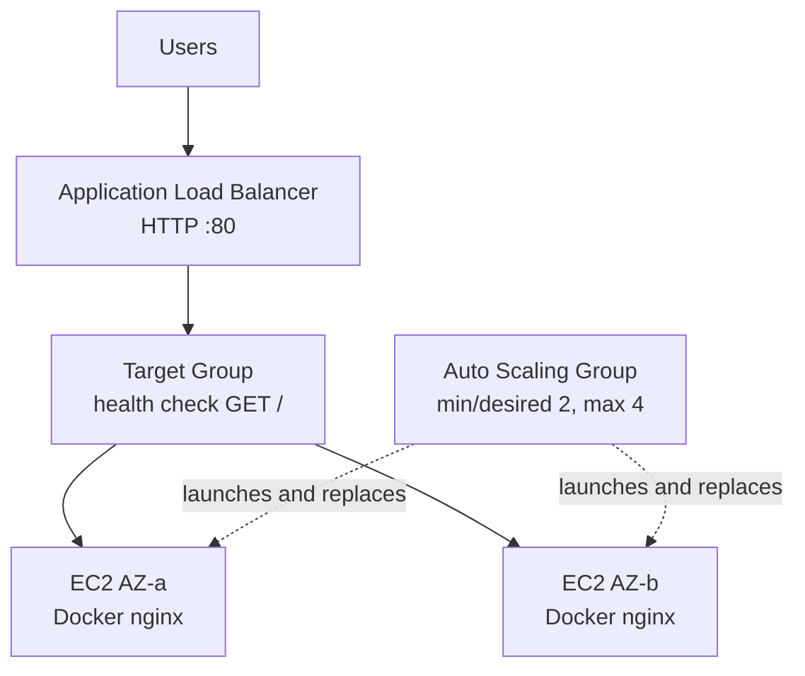

# Auto-Healing Web Tier (AWS + Terraform)

A self-healing, N+1 static web tier: an Application Load Balancer spreading traffic across at least two EC2 instances managed by an Auto Scaling Group. Terminating any single instance does not take the site down, and the platform replaces it automatically.

**Repository:** https://github.com/xmopher/auto-healing-web-tier

## Cloud choice: AWS

- **Auto Scaling Group** gives VM-level self-healing natively: an instance that is terminated or fails its health check is replaced with no operator action.
- **Application Load Balancer** with target-group health checks keeps traffic on healthy targets only, which is what makes "lose any single VM without downtime" true rather than aspirational.
- The building blocks are few and cheap (no NAT Gateway, no managed control plane), so the design stays inside a small budget and inside the 7–8 hour target effort.

Azure VMSS + Load Balancer would satisfy the same brief. I chose AWS because ASG/ALB is the stack I can deliver most cleanly and cost-transparently here. Kubernetes (EKS) was deliberately rejected: the brief's healing unit is a VM, and an EKS control plane alone is roughly AUD 110/month, which would breach the cost target before a single instance runs.

## Architecture

```text
                        Internet
                           |
                    ALB (HTTP :80)
                    public subnets, 2 AZs
                           |
                    Target Group
                    health check GET / -> 200
                           |
              +------------+------------+
              |                         |
        EC2 (AZ-a)                EC2 (AZ-b)
        Docker -> NGINX           Docker -> NGINX
              |                         |
              +------------+------------+
                           |
                  Auto Scaling Group
                  min=2  desired=2  max=4
                  health_check_type = ELB
```



A draw.io-friendly copy lives in [`docs/architecture.md`](docs/architecture.md).

### How the must-haves are met

| Requirement | Implementation |
|-------------|----------------|
| Self-healing | ASG with `health_check_type = ELB`; a terminated or unhealthy instance is replaced automatically, and the ALB stops routing to it immediately |
| Self-provisioning (IaC only) | `terraform apply` builds everything from an empty account; no console steps |
| Idempotent | A second run reports no changes (see the caveat about AMI lookup under Assumptions) |
| N + 1 capacity | `min_size = desired_capacity = 2` across two AZs behind one ALB |
| Static web page | NGINX welcome page served from a container on each instance |
| Templates | Terraform 1.15 with AWS provider `~> 5.0`, split into `network` / `alb` / `asg` modules |

## Repository layout

```text
.
├── versions.tf / providers.tf / variables.tf / main.tf / outputs.tf
├── example.tfvars              # sample inputs
├── Dockerfile                  # optional bonus image
├── modules/
│   ├── network/                # VPC, public subnets, IGW, routing, security groups
│   ├── alb/                    # ALB, target group, listener
│   └── asg/                    # launch template, ASG, user-data
├── docs/architecture.md
└── .github/workflows/terraform.yml
```

**Naming:** every resource is prefixed `{project_name}-{environment}`, e.g. `autoheal-web-dev-alb`.

**Tagging:** applied globally through provider `default_tags` — `Project`, `Environment`, `Owner`, `ManagedBy = terraform`.

## Prerequisites

- Terraform `>= 1.5` (developed and verified on 1.15.8)
- AWS credentials able to manage VPC, EC2, ELBv2 and Auto Scaling
- Optional: Docker, if you want to build and publish your own page image

```bash
terraform version
aws sts get-caller-identity
```

## Usage

```bash
git clone https://github.com/xmopher/auto-healing-web-tier.git
cd auto-healing-web-tier
```

### 1. Initialise

```bash
terraform init
```

### 2. Plan — this is the intended review artefact

```bash
terraform plan -var-file=example.tfvars
```

Verified locally against `ap-southeast-2`:

```text
Plan: 14 to add, 0 to change, 0 to destroy.
```

### 3. Apply (optional)

```bash
terraform apply -var-file=example.tfvars
terraform output alb_dns_name
```

Browse to `http://<alb_dns_name>/` for the NGINX welcome page. Allow two to three minutes for instances to pass health checks after apply returns.

### 4. Destroy

```bash
terraform destroy -var-file=example.tfvars
```

### Verifying self-healing

1. Confirm two healthy targets in the ALB target group.
2. Terminate one instance (console or `aws ec2 terminate-instances`).
3. The ALB serves continuously from the surviving instance while the ASG launches a replacement, which joins the target group once healthy.

## Input variables

| Variable | Default | Purpose |
|----------|---------|---------|
| `aws_region` | `ap-southeast-2` | Deployment region |
| `project_name` | `autoheal-web` | Name prefix and `Project` tag |
| `environment` | `dev` | Name prefix and `Environment` tag |
| `owner` | `xmopher` | `Owner` tag |
| `vpc_cidr` | `10.0.0.0/16` | VPC address space |
| `instance_type` | `t3.micro` | Web instance size — the main compute cost lever |
| `desired_capacity` / `min_size` | `2` | N+1 capacity; validation rejects values below 2 |
| `max_size` | `4` | Headroom for replacement and scaling |
| `docker_image` | `nginx:alpine` | Image pulled by user-data |

## Optional bonus: containerised page

- [`Dockerfile`](Dockerfile) builds on `nginx:alpine`.
- Instance user-data installs Docker, pulls `var.docker_image`, and runs it with `--restart=always` on port 80.
- The default is the public `nginx:alpine`, so no registry credentials are needed for a reviewer to run a plan.

To publish and use your own image:

```bash
docker build -t ghcr.io/<you>/auto-healing-web-tier:latest .
docker push ghcr.io/<you>/auto-healing-web-tier:latest
```

```hcl
# terraform.tfvars (not committed)
docker_image = "ghcr.io/<you>/auto-healing-web-tier:latest"
```

Private images would additionally need an instance profile plus a registry login in user-data; out of scope here.

## Pipeline

[`.github/workflows/terraform.yml`](.github/workflows/terraform.yml) runs on every push and pull request to `main`:

| Step | Requires AWS credentials |
|------|--------------------------|
| `terraform fmt -check -recursive` | No |
| `terraform init -backend=false` | No |
| `terraform validate` | No |
| `terraform plan -var-file=example.tfvars` | Yes — skipped automatically when secrets are absent |

Add `AWS_ACCESS_KEY_ID` and `AWS_SECRET_ACCESS_KEY` under Settings → Secrets and variables → Actions to enable the plan step. It is plan-only by design; nothing in CI applies.

## Assumptions

1. Region is `ap-southeast-2` (Sydney), appropriate for an Australian audience.
2. Public subnets only, no NAT Gateway. Instances hold public IPs so they can pull packages and images; a NAT Gateway would add roughly AUD 55/month for no benefit at this scale.
3. Instances accept port 80 only from the ALB security group. No SSH ingress and no key pair; use SSM Session Manager if shell access is ever needed.
4. HTTP only. HTTPS would require ACM plus a domain, which is outside the brief.
5. State is local. A shared team setup would use an S3 backend with DynamoDB locking; that would need bootstrap resources that the "one command" requirement discourages.
6. The AMI is resolved with a `most_recent` lookup of Amazon Linux 2023. Repeat plans are stable until AWS publishes a new AMI, at which point the launch template will show a change. Pinning `image_id` to a variable would make idempotency absolute at the cost of manual AMI updates — a trade-off I would resolve with the team's patching policy.
7. Cost figures below are on-demand list prices for Sydney at 730 hours per month, converted at 1 USD ≈ 1.55 AUD. They exclude account-level free tier or promotional credits.

## Estimated monthly cost

### Fully deployed, running 24×7

| Component | Unit price (USD) | Monthly USD | Monthly AUD |
|-----------|------------------|-------------|-------------|
| ALB, fixed hours | 0.0225 /hr | 16.43 | ~25.50 |
| ALB, LCU (near-idle demo traffic) | 0.008 /LCU-hr | 0–5.80 | ~0–9.00 |
| EC2, 2 × `t3.micro` | 0.0132 /hr each | 19.27 | ~29.90 |
| EBS, 2 × 8 GB gp3 | 0.096 /GB-month | 1.54 | ~2.40 |
| NAT Gateway | — | 0 | 0 (deliberately omitted) |
| Data transfer out | first 100 GB free | ~0 | ~0 |
| **Total** | | **~37–43** | **~AUD 58–67** |

### On the ≤ AUD 20 target

I want to be straight about this rather than present a number that only works on paper: **an always-on managed load balancer plus two instances in Sydney cannot be delivered for AUD 20 per month.** The ALB's fixed hourly charge alone is about AUD 25.50 before any compute, and every managed alternative (NLB, CLB) is priced the same or higher. Any estimate claiming otherwise is either excluding the load balancer, assuming free-tier credits that expire, or not running continuously.

What the design does do is remove every avoidable cost around that floor:

| Decision | Saving vs. a naive build |
|----------|--------------------------|
| No NAT Gateway (public subnets + tight security groups) | ~AUD 65/month |
| No EKS control plane | ~AUD 110/month |
| Burstable `t3.micro` instead of a `t3.medium` pair | ~AUD 90/month |
| Minimal gp3 root volumes, no detailed monitoring, no WAF or CloudFront | ~AUD 15/month |

And these are the levers that genuinely bring the running cost to or below AUD 20, with their trade-offs:

| Lever | Resulting cost | Trade-off |
|-------|----------------|-----------|
| Run as a part-time dev environment (~8 h × 5 days, destroyed or scaled to zero otherwise) | ~AUD 14–16/month | Not continuously available; acceptable for dev, not for production |
| `instance_type = "t3.nano"` (variable already exposed) | Total ~AUD 43–52/month | Halves compute; the ALB floor is unchanged |
| `t4g.nano` on Graviton (needs an arm64 AMI filter) | Total ~AUD 40–49/month | Cheapest compliant compute; the ALB floor is unchanged |
| Replace the ALB with Route 53 health-checked DNS records | ~AUD 15/month on nano instances | Rejected: the brief explicitly requires a load balancer, and DNS failover recovers only as fast as the TTL |

**My recommendation:** keep ALB + ASG as built, since it is the configuration that actually satisfies "lose any single VM without downtime". Budget roughly AUD 58–67/month for a 24×7 production-shaped tier in Sydney, or roughly AUD 15/month if it runs only during working hours. If AUD 20 were a hard ceiling on a live always-on service, the honest conversation is about relaxing either the managed-load-balancer requirement or the always-on requirement — I would not hide that behind an optimistic spreadsheet.

For this assessment no apply is required, so reviewing the plan output costs nothing. That is a statement about the review process, not a way of meeting the budget.

Figures are worth re-checking in the [AWS Pricing Calculator](https://calculator.aws/) before any long-running deployment.

## Out of scope

- HTTPS/ACM and a custom domain
- Private subnets, NAT, and SSM-only access
- Remote state backend and state locking
- Blue/green or rolling deployment strategy beyond ASG instance refresh
- Multi-environment promotion; only `dev` defaults are provided

## Commit history

Commits follow the build order so the process is visible: repository setup → Terraform scaffold and conventions → network module → provider lock → ALB module → ASG with user-data → documentation → CI.
