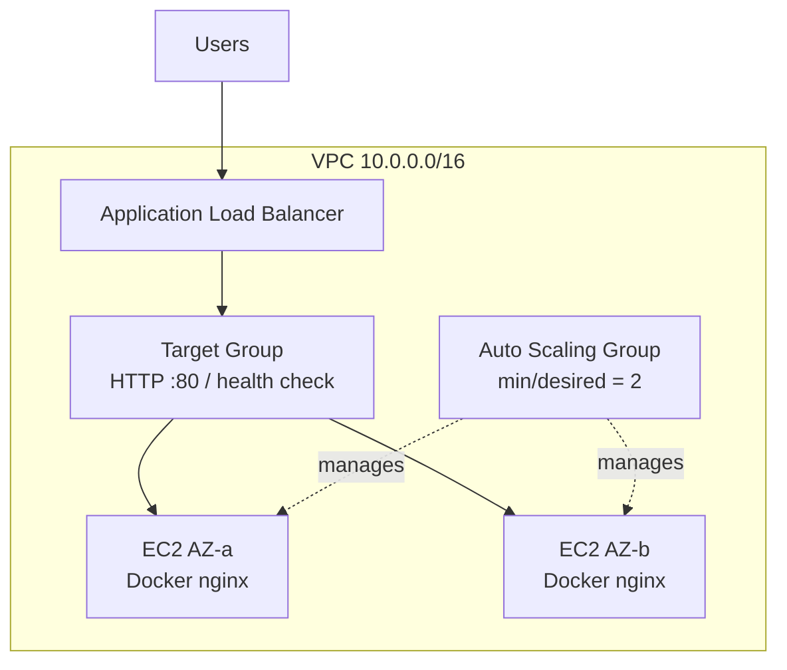

# Auto-Healing Web Tier (AWS)

Terraform take-home that stands up a self-healing, N+1 static web tier behind an Application Load Balancer.

**Repository:** https://github.com/xmopher/auto-healing-web-tier

## Cloud choice

**AWS** (Terraform) was chosen because:

- **Auto Scaling Groups** replace terminated instances automatically (self-healing at the VM layer).
- **Application Load Balancer** + target-group health checks keep traffic on healthy instances only (no downtime when one VM is lost).
- The pattern matches a typical Infrastructure Engineer web-tier design and stays simple enough to keep cost low (small instances, no NAT Gateway).

Azure VMSS would also work; AWS ASG + ALB is the stack I can deliver most cleanly for this brief.

## Architecture

```text
                        Internet
                           |
                     ALB (:80 HTTP)
                           |
              +------------+------------+
              |                         |
         Target Group              Health check
         (HTTP /, 200)             path = /
              |
     +--------+--------+
     |                 |
  EC2 (AZ-a)        EC2 (AZ-b)
  Docker/NGINX      Docker/NGINX
     ^                 ^
     +--------+--------+
              |
     Auto Scaling Group
     min=2 desired=2 max=4
     health_check_type = ELB
```



A draw.io-friendly copy lives in [`docs/architecture.md`](docs/architecture.md).

### How must-haves are met

| Requirement | Implementation |
|-------------|----------------|
| Self-healing | ASG replaces unhealthy/terminated instances; ALB stops sending traffic until the replacement is healthy |
| Self-provisioning (IaC) | `terraform apply` creates everything; a second apply should show no changes |
| N+1 capacity | `min_size` / `desired_capacity` = 2 across two AZs behind one ALB |
| Static web page | Each instance runs NGINX via Docker (`nginx:alpine` by default) |
| Idempotent modules | Separate `network`, `alb`, `asg` modules with shared naming/tags |

## Repository layout

```text
.
├── main.tf / variables.tf / outputs.tf / providers.tf / versions.tf
├── example.tfvars
├── Dockerfile
├── modules/
│   ├── network/   # VPC, public subnets, IGW, security groups
│   ├── alb/       # ALB, target group, listener
│   └── asg/       # Launch template, ASG, user-data
└── docs/architecture.md
```

**Naming:** `{project}-{environment}-...` (default `autoheal-web-dev-...`)  
**Tags (default_tags):** `Project`, `Environment`, `Owner`, `ManagedBy=terraform`

## Prerequisites

- Terraform `>= 1.5` (tested with `1.15.x`)
- AWS credentials with permission to manage VPC, EC2, ELBv2, Auto Scaling, IAM (if extended later)
- Optional: Docker (to build/push the bonus image)

```powershell
aws sts get-caller-identity
terraform version
```

## Usage

### 1) Init

```powershell
cd D:\Project\devops_homework
terraform init
```

### 2) Plan (recommended deliverable)

```powershell
terraform plan -var-file=example.tfvars
```

Reviewers can rely on plan output without applying. Provisioning is optional per the brief.

### 3) Apply (optional)

```powershell
terraform apply -var-file=example.tfvars
```

After apply, open the ALB DNS from outputs:

```powershell
terraform output alb_dns_name
```

Visit `http://<alb_dns_name>/` for the NGINX welcome page.

### 4) Destroy (recommended after demo)

```powershell
terraform destroy -var-file=example.tfvars
```

## Optional Docker bonus

- [`Dockerfile`](Dockerfile) builds from `nginx:alpine`.
- Instance **user-data** installs Docker, pulls `var.docker_image`, and runs it on port 80.
- Default image is public `nginx:alpine` (no registry login required).

To use your own image (GHCR / Docker Hub):

```powershell
docker build -t ghcr.io/<you>/auto-healing-web-tier:latest .
docker push ghcr.io/<you>/auto-healing-web-tier:latest
```

Then set in a local `terraform.tfvars` (not committed):

```hcl
docker_image = "ghcr.io/<you>/auto-healing-web-tier:latest"
```

## Assumptions

1. Region defaults to **ap-southeast-2** (Sydney).
2. **Public subnets only** — no NAT Gateway (major cost saving). Instances get public IPs to pull images/packages; SSH is not exposed (instance SG allows port 80 only from the ALB SG).
3. HTTP only on port 80 (no ACM/HTTPS) to keep scope and cost small.
4. Default container image `nginx:alpine` is acceptable for the static welcome page.
5. Reviewers may evaluate **`terraform plan` only**; long-running apply is optional.
6. Prices below are approximate on-demand figures for Sydney and will vary with FX, LCU usage, and Free Tier eligibility.

## Estimated monthly cost (AUD)

**Design-to-cost choices:** `t3.micro`, two instances only, no NAT, no bastion, minimal EBS, ALB only (no WAF/CloudFront).

Approximate on-demand (730 h/month, FX ≈ 1 USD = 1.55 AUD):

| Resource | Approx. monthly (AUD) | Notes |
|----------|------------------------|-------|
| EC2 2× `t3.micro` | ~30 | ~USD 0.0132/h each |
| Application Load Balancer (hours) | ~25–30 | Dominant fixed cost |
| EBS (gp3, small root volumes) | ~2–4 | Depends on AMI defaults |
| Data transfer / LCU | ~0–3 | Negligible for a demo page |
| NAT Gateway | **0** | Intentionally omitted |
| **Sustained 24×7 total** | **~60** | Exceeds AUD 20 if left running all month |

**How this stays within ≤ AUD 20 for the assessment**

| Mode | Est. cost | Notes |
|------|-----------|--------|
| Plan-only (no apply) | **AUD 0** | Matches “review plan outputs only” |
| Apply for review then destroy (e.g. ≤ 48 h) | **~AUD 3–6** | Full stack briefly for verification |
| Free Tier eligible EC2 hours | Reduces EC2 line item | ALB still accrues while deployed |

**Conclusion:** The stack is sized for a cheap lab. Continuous always-on ALB + 2× EC2 in Sydney typically exceeds AUD 20/month; the intended operating model for this homework is **plan-first**, and **destroy after any apply**, which keeps spend ≤ AUD 20.

Verify with the [AWS Pricing Calculator](https://calculator.aws/) before a long-running apply.

## Self-healing demo (if applied)

1. Note two healthy targets in the ALB target group.
2. Terminate one EC2 instance in the console.
3. ASG launches a replacement; ALB drains/fails the old target and registers the new one.
4. `http://<alb_dns_name>/` should remain available via the surviving instance during replacement.

## What is intentionally out of scope

- HTTPS / ACM certificates
- Private subnets + NAT
- CI apply to a shared account (lint/validate/plan-only would be enough if added)
- Multi-environment promotions (only `dev` defaults)

## Commit history

Incremental commits follow the build order: scaffold → network → ALB → ASG → docs.
