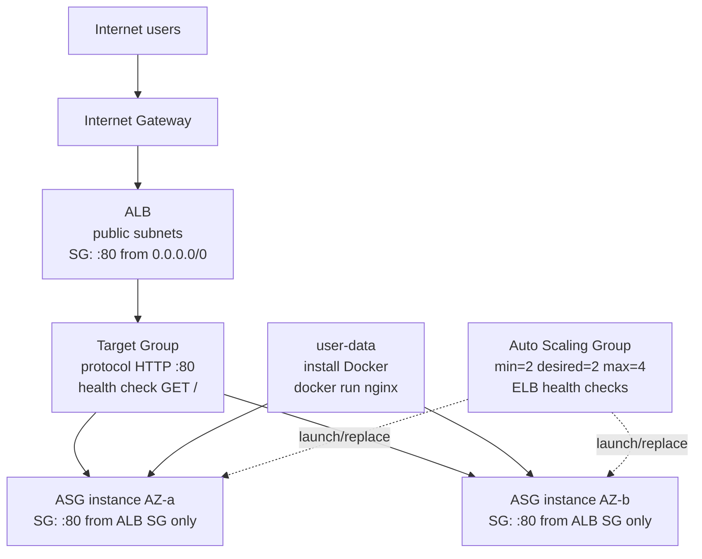

# Architecture

## Logical diagram



## Network sketch

```text
VPC 10.0.0.0/16
├── public subnet AZ-a  10.0.0.0/24
├── public subnet AZ-b  10.0.1.0/24
├── IGW + public route  0.0.0.0/0
├── SG alb              ingress 80/tcp world
└── SG instance         ingress 80/tcp from SG alb
```

## Module map

```text
root
├── module.network  → vpc_id, subnet_ids, sg ids
├── module.alb      → alb_dns_name, target_group_arn
└── module.asg      → asg_name (registers into target group)
```

You can paste the Mermaid blocks into [draw.io](https://app.diagrams.net/) (Arrange → Insert → Advanced → Mermaid) if a `.drawio` file is preferred for submission.
